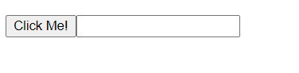

## Web Component Ui Module
Study. how to make reusable UI !!

## How to make
```
// Create a class for the element
class  InputGroup  extends  HTMLParagraphElement {
	constructor() {
		// Always call super first in constructor
		super();

		// To do : custom actions...
		
		});
	}
}
```

## How to use
```
<body>
	<p is="input-group"></p>
</body>
```

## Result
